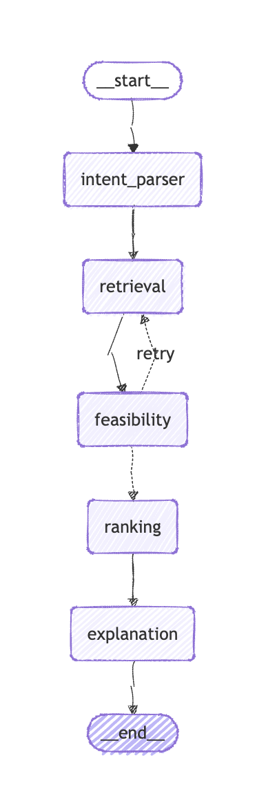

## This project is intended for GenAI Zurich Hackathon 2026

## Agent Pipeline

The pipeline runs as a LangGraph state machine. Each box is an agent node; arrows show data flow.

| Agent | Role |
|---|---|
| **intent_parser** | Takes the user's raw text and calls GPT-4o to extract structured fields: `category`, `requested_time`, `radius_km`, and `constraints`. Defaults missing time to now+1h, missing radius to 5 km. |
| **retrieval** | Loads providers from the seed file (later: Supabase), filters by category, computes haversine distance from the user's location, and keeps only providers within `radius_km`. On retry, the radius widens by 50%. |
| **feasibility** | For each candidate, checks that the provider is open on the requested day and that the user can arrive before closing (with a 15-minute buffer). Providers that don't pass are dropped. If zero pass, `retry_count` increments and the pipeline loops back to retrieval. |
| **ranking** | Scores every feasible provider on a weighted sum of price, distance, and rating — each normalised to [0, 1]. Sorts descending by score. |
| **explanation** | Reads the score breakdown and attaches the top-3 human-readable reasons to each offer (e.g. "Affordable pricing", "Close by", "Highly rated"). |

---

## Stack

| Layer | Tech |
|---|---|
| Framework | FastAPI (Python 3.11+) |
| Agent orchestration | LangGraph |
| LLM | OpenAI GPT-4o |
| Database + Realtime | Supabase (PostgreSQL) |

---
