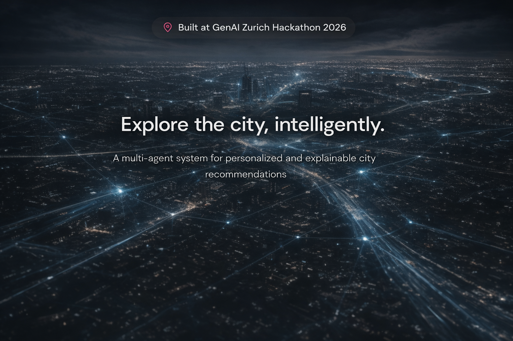
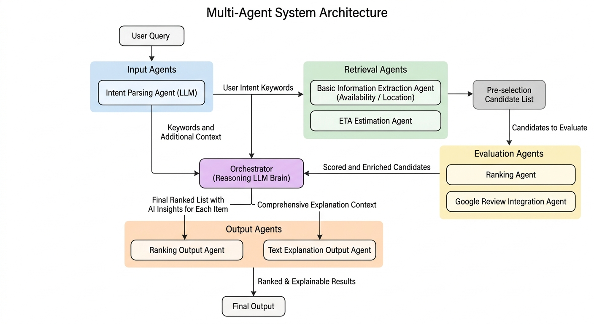

# Mapify AI

> A multi-agent city assistant that turns natural-language intent into personalized, explainable local recommendations.

🌐 [Website](https://mapify-ai-rose.vercel.app/landing) · 🎮 Demo · 🎥 Video

---

## Overview

Mapify AI rethinks how people explore cities.

Instead of browsing static map results, users can describe their needs in natural language (e.g., *“dinner near ETH tonight under CHF 30”*), and the system automatically retrieves, filters, ranks, and explains suitable places.

At its core, Mapify AI is a **map-based multi-agent system** that integrates heterogeneous signals — including travel time, opening hours, pricing, ratings, and reviews — into a structured decision-making pipeline.

---

## System

The system is implemented as a **LangGraph-based multi-agent pipeline**, where each stage performs a specific reasoning step:

User Query
 → Intent Parsing
 → Information Retrieval
 → Transit Filtering
 → Score Calculation and Ranking & Review Analysis
 → Recommendation Synthesis

A key design choice is the separation between:

- **evaluation (scoring)**  
- **review understanding (textual signals)**  

which are later merged by an orchestrator before generating final recommendations.

This modular design enables:

- interpretable intermediate states  
- flexible extension of agents  
- clearer debugging and evaluation  

---

## Key Capabilities

- Natural-language query → structured constraints  
- Multi-factor ranking (price, travel time, rating)  
- User-controlled preference weighting  
- Explainable recommendations with reasoning  
- Real-time pipeline execution (streaming)  

---

## Demo

- Website: https://mapify-ai-rose.vercel.app/landing  
- Interactive frontend demo available  

---

## Architecture

The system consists of:

- a React frontend for interaction and visualization  
- a FastAPI + LangGraph backend for multi-agent orchestration  
- external services (LLM, Google Maps via Apify, transport APIs)  

---

## Limitations

This is a hackathon prototype:

- Merchant-side features are frontend-only  
- Some backend modules are partially scaffolded  
- External APIs are required for full functionality  

---

## Future Work

- Full marketplace integration (merchant ↔ user loop)  
- Learning-based personalization  
- Improved retrieval beyond seed data  
- Unified streaming architecture  

---

## Contributors

- Deqing Song
- Qing Dai
- Yuqing Huang
- Yuan Yu
